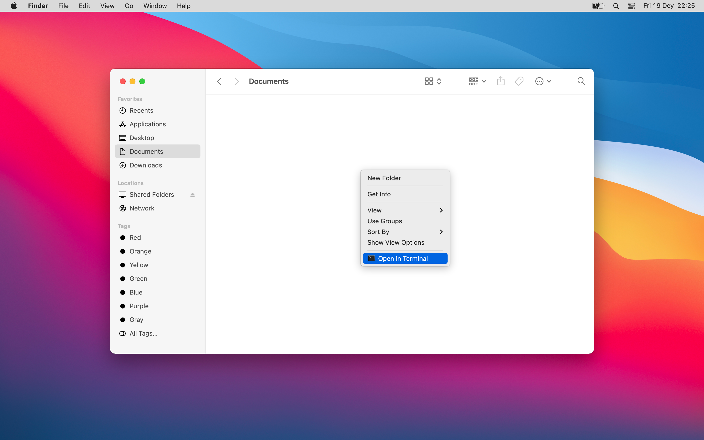
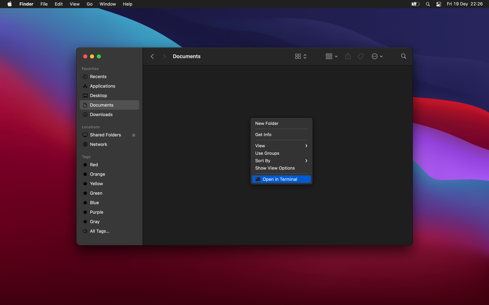

# SzContext
## Description
Provides your favorite apps at your hand. 
Open files or folders using your favorite app from Finder® context menu. 

## System compatibility 
macOS 10.15+ 

## Preview
**Light**

**Dark**

## Installation
Download the [v0.4](https://github.com/RoadToDream/SzContext/releases/download/0.4/SzContext.dmg) dmg file, drag SzContext.app to Application folder. Open SzContext.app and follow the instructions.

