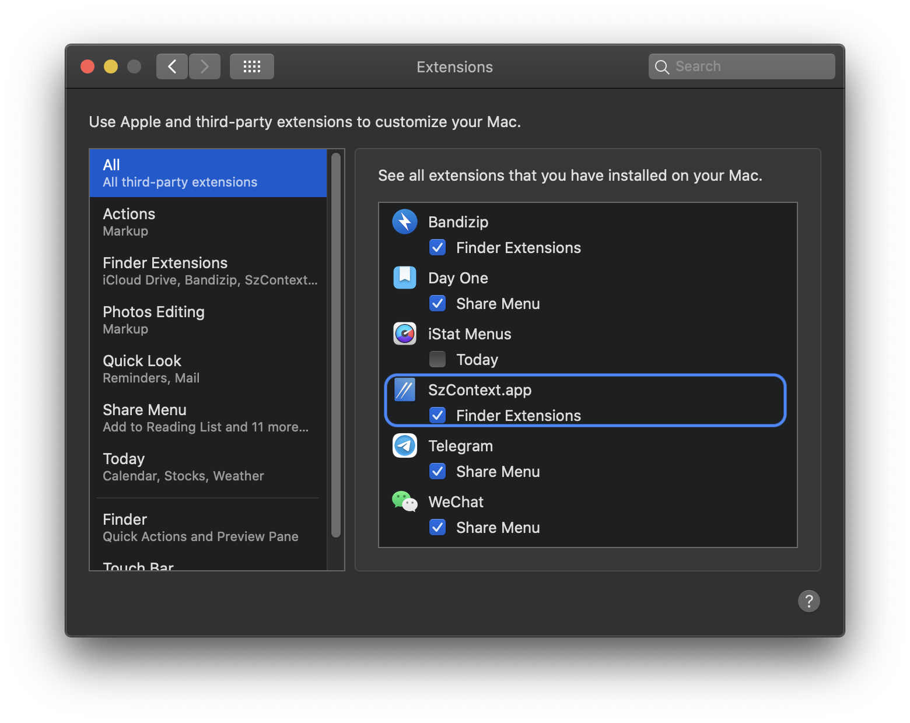

# SzContext
## Description
Add context menu to macOS Finder 
A very basic implementation add Open in VS Code and Open in Terminal functionality to context menu in Finder. Will make it a more complete one later this month. 
Here are some screenshots. 

**Dark**

**Light**

## Installation
Provided two methods to install, one as a standalone app, and another can integrate to your VS Code.
1. Standalone
Download the v0.2 zipfile, unzip and open the Standalone folder, open SzContext.app and the System Preference will pops up, make sure SzContext is checked and you are good(see figure attached below).

2. Integrate
To integrate SzContext to your VS Code, download the v0.2 zipfile, unzip and open the Integrate folder, then execute install.sh in terminal
> chmod +x install.sh && sh ./install.sh

Then you are good to go. 

